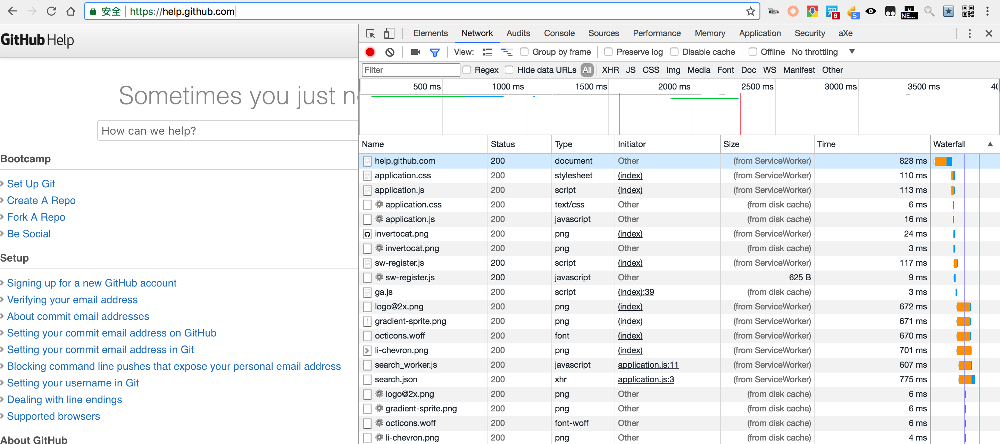
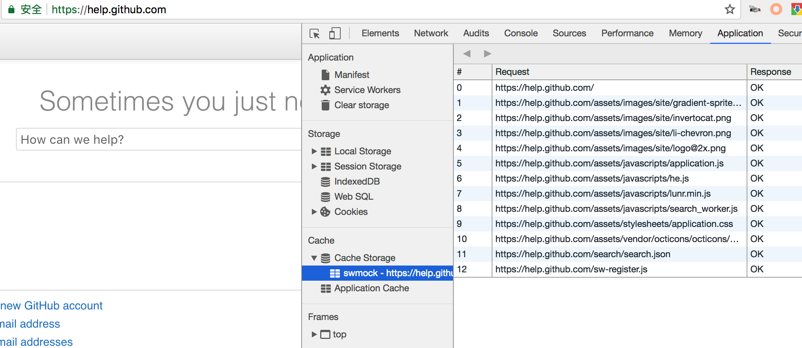

# whistle.swmock

基于servcie worker的动态mock插件。

### 配置示例:

```
127.0.0.1 whistle.swmock:///api/*  # 仅动态mock /api路径下的数据
127.0.0.1 whistle.swmock://*  # mock所有匹配到的数据
/./ whistle.swmock://*  # 缓存所有的https网站（可实现弱网加速效果）
```

### 弱网（离线）访问效果图


